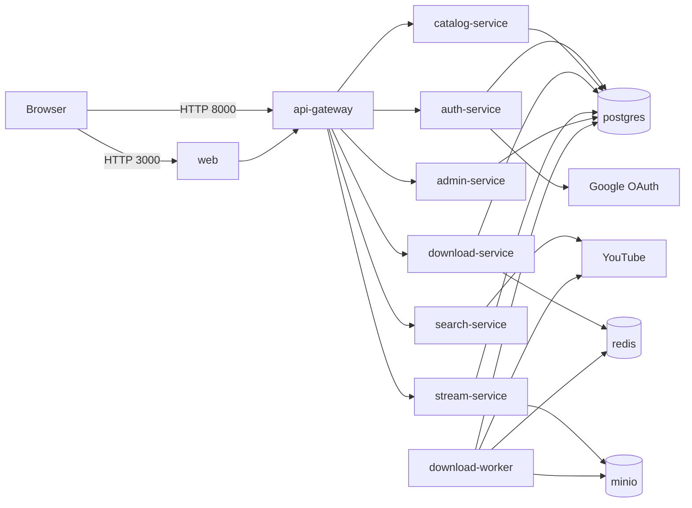
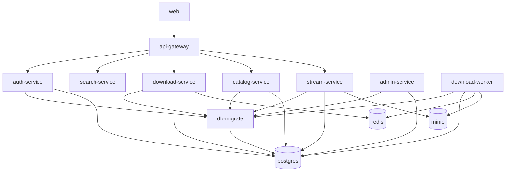

# spotify-youtube

Python-first microservices MVP for a Spotify-like app with YouTube search/import flow.


## Stack
- FastAPI services
- Celery + Redis queue
- PostgreSQL via SQLAlchemy
- Alembic for schema migrations
- MinIO (S3-compatible) for audio objects
- FastAPI web frontend + optional Next.js admin scaffold
- Docker Compose local orchestration

## Local persistent data
- `infra/docker/data/postgres`
- `infra/docker/data/redis`
- `infra/docker/data/minio`

These folders keep data between container restarts.

## Environment File
Before starting the app, create a local `.env` file from the template:

```bash
cp .env.example .env
```

Windows `cmd`:

```cmd
copy .env.example .env
```

Then edit `.env` and set your real values (especially secrets like `JWT_SECRET`, DB credentials, and OAuth keys if used).

## Run
```bash
docker compose up --build
```

## Exposed Ports
- `3000` -> user web frontend
- `8000` -> API gateway
- `8005` -> signed stream endpoint

Internal services (`auth-service`, `catalog-service`, `search-service`, `download-service`, `admin-service`) and data stores (`postgres`, `redis`, `minio`) are network-internal only.

## Production Deployment (Single VM)
Use the production override with TLS edge proxy (`edge`) and Docker secrets files:

1. Create secret files:
- `infra/secrets/jwt_secret.txt`
- `infra/secrets/internal_service_secret.txt`
- `infra/secrets/database_url.txt`
- `infra/secrets/tls.crt`
- `infra/secrets/tls.key`

2. Set `APP_DOMAIN` and production env values in `.env`.

3. Start:

```bash
docker compose -f docker-compose.yml -f docker-compose.prod.yml up -d --build
```

In production mode:
- only `80/443` are exposed via `edge`
- internal services are not host-exposed
- `/api/*` is proxied to `api-gateway`
- `/api/public/stream/*` is proxied to `stream-service`
- edge applies basic scanner UA blocking + request rate limits on sensitive endpoints

## Secret Manager Integration
Critical secrets support `*_FILE` loading:
- `JWT_SECRET_FILE`
- `INTERNAL_SERVICE_SECRET_FILE`
- `DATABASE_URL_FILE`

This allows cloud secret manager mounts (or Docker/K8s secret files) without putting secrets directly in env vars.

## Monitoring and Alerts
Start monitoring stack:

```bash
docker compose -f docker-compose.yml -f docker-compose.monitoring.yml up -d
```

Endpoints:
- Prometheus: `http://localhost:9090`
- Alertmanager: `http://localhost:9093`

Alert rules are in `infra/monitoring/alerts.yml` (auth failures, 429 spikes, admin traffic spikes).

## CI Security Scans
GitHub Actions workflow added at `.github/workflows/security.yml`:
- `pip-audit` on all Python services
- `npm audit` for `apps/admin-web`
- `trivy` filesystem scan for high/critical issues

## Frontends
- User frontend is now FastAPI + Uvicorn at `http://localhost:3000` (served by `web` service in Docker Compose).
- Admin frontend remains in `apps/admin-web` (Next.js scaffold) if you want a separate admin UI later.

## Run Admin UI (`apps/admin-web`)
`admin-web` is not part of `docker-compose.yml`, so run it separately.

1. Start backend stack:

```bash
docker compose up -d
```

2. In another terminal:

```bash
cd apps/admin-web
npm install
npm run dev
```

3. Open:
- `http://localhost:3001`

Notes:
- Admin UI calls gateway admin endpoints through `http://localhost:8000`.
- Use an admin token to access admin data endpoints.

## Main gateway API (`http://localhost:8000`)
- `POST /auth/signup`
- `POST /auth/verify-email`
- `POST /auth/signin`
- `POST /auth/refresh`
- `POST /auth/logout`
- `GET /auth/google/login`
- `GET /auth/google/callback`
- `GET /songs/search?q=...` (requires bearer token)
- `POST /songs/import` (requires bearer token)
- `GET /library` (requires bearer token)
- `GET /jobs/{job_id}` (requires bearer token)
- `GET /stream/{song_id}` (requires bearer token; redirects to stream URL)
- `GET /admin/users` (admin token)
- `GET /admin/songs` (admin token)
- `GET /admin/jobs` (admin token)

## Service Graph
Generated from `docker-compose.yml`.

### Runtime Communication



### Startup / `depends_on`



### Outbound Connectivity (Who Can Contact Who)
- `browser` -> `web`, `api-gateway`
- `web` -> `api-gateway`
- `api-gateway` -> `auth-service`, `search-service`, `download-service`, `catalog-service`, `stream-service`, `admin-service`
- `auth-service` -> `postgres`, `google-oauth`
- `search-service` -> `youtube`
- `download-service` -> `postgres`, `redis` (Celery broker/backend)
- `download-worker` -> `redis` (Celery broker/backend), `postgres`, `minio`, `youtube`
- `catalog-service` -> `postgres`
- `stream-service` -> `postgres`, `minio`
- `admin-service` -> `postgres`
- `db-migrate` -> `postgres`

## Notes
- Admin bootstrap is controlled by `ADMIN_BOOTSTRAP_EMAIL` (no automatic first-user admin).
- With `EMAIL_VERIFY_REQUIRED=1`, users must verify email before signin.
- In dev, signup response can include verification token only when `EXPOSE_VERIFICATION_TOKEN=1`.
- Refresh token is stored in an HttpOnly cookie by gateway (`/auth/signin` and `/auth/refresh`).
- Internal service-to-service calls are protected with short-lived `X-Service-Token`.
- Worker uses `yt-dlp` and `ffmpeg` to fetch/transcode audio to AAC 256kbps.
- YouTube download/storage legal and platform-policy review is required before production.
