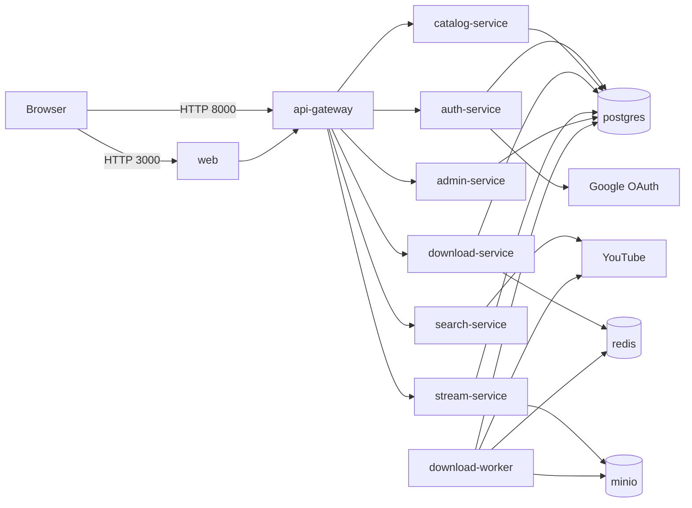
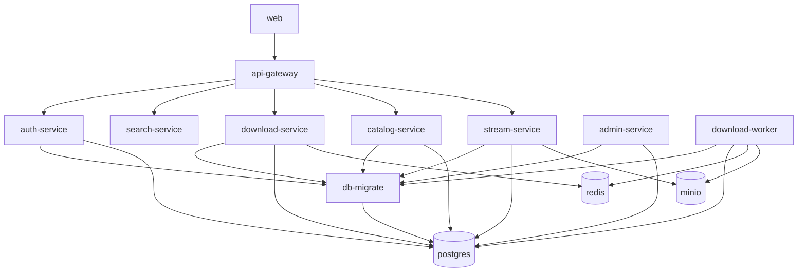

# spotify-youtube (Quickstart First)

Python-first microservices MVP for a Spotify-like app with YouTube search/import flow.

## Main Frontend Stack
- Vite
- React
- TypeScript
- Tailwind CSS

## TL;DR
1. Copy env file:
```bash
cp .env.example .env
```
Windows `cmd`:
```cmd
copy .env.example .env
```
2. Set real secrets in `.env`.
3. Start:
```bash
docker compose up --build
```
4. Open:
- User app: `http://localhost:3000`
- Gateway: `http://localhost:8000`

## What Is Exposed
- `3000` -> user web
- `8000` -> API gateway
- `8005` -> stream endpoint

Everything else is internal-only in Docker network.

## Local Development
### Persistent data folders
- `infra/docker/data/postgres`
- `infra/docker/data/redis`
- `infra/docker/data/minio`

### Admin UI (separate)
```bash
docker compose up -d
cd apps/admin-web
npm install
npm run dev
```
Open `http://localhost:3001`.

## Gateway API
- `POST /auth/signup`
- `POST /auth/verify-email`
- `POST /auth/signin`
- `POST /auth/refresh`
- `POST /auth/logout`
- `GET /auth/google/login`
- `GET /auth/google/callback`
- `GET /songs/search?q=...`
- `POST /songs/import`
- `GET /library`
- `GET /jobs/{job_id}`
- `GET /stream/{song_id}`
- `GET /admin/users`
- `GET /admin/songs`
- `GET /admin/jobs`

## Service Graph
### Runtime Communication


### Startup / `depends_on`


## Production (Single VM)
Use:
```bash
docker compose -f docker-compose.yml -f docker-compose.prod.yml up -d --build
```

Required secret files:
- `infra/secrets/jwt_secret.txt`
- `infra/secrets/internal_service_secret.txt`
- `infra/secrets/database_url.txt`
- `infra/secrets/tls.crt`
- `infra/secrets/tls.key`

In prod:
- edge proxy exposes only `80/443`
- `/api/*` -> `api-gateway`
- `/api/public/stream/*` -> `stream-service`
- `web` is built as static assets and served by Nginx (SPA fallback enabled)

## Security Highlights
- Internal service auth via short-lived `X-Service-Token`
- Refresh token in HttpOnly cookie
- No automatic first-user admin role
- Signed short-lived stream URLs
- Rate limiting on sensitive/high-cost endpoints
- Containers run as non-root

## Monitoring
Start monitoring stack:
```bash
docker compose -f docker-compose.yml -f docker-compose.monitoring.yml up -d
```
- Prometheus: `http://localhost:9090`
- Alertmanager: `http://localhost:9093`

## CI Security
Workflow: `.github/workflows/security.yml`
- `pip-audit`
- `npm audit`
- `trivy`

## Notes
- `ADMIN_BOOTSTRAP_EMAIL` controls admin bootstrap.
- `EMAIL_VERIFY_REQUIRED=1` enforces email verification.
- `EXPOSE_VERIFICATION_TOKEN=1` only for local/dev convenience.
- Legal/policy review is required before production launch.
